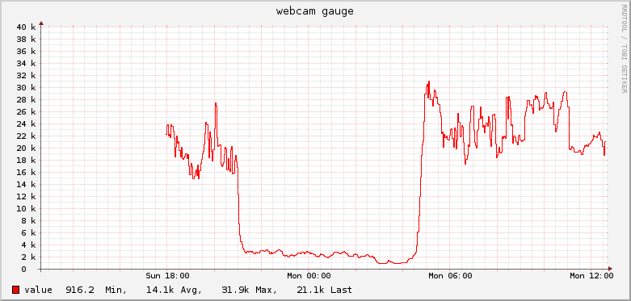

webcam2collectd
===

This is a tool that is designed for giving a basic idea of how bright
it was outside at any point, to do this, it will poll a http webcam
and then submit a value to signify how bright the image is back to
a collectd server, where it can then be graphed along with other things

###Notes for rPi users

Turns out, even the B+ pi is still pretty slow, so if your webcam is
640x480 image res, you cannot afford to sample every pixel every 10
seconds, as this takes too long on the CPU. For this reason a 
`sampleskip` flag is in the program, that will result in every {n}
pixel being sampled, the higher the value, the less work there is 
on the CPU to do, though ideally you will want to set the value
as one, on slow as hell boxes, you will have to set the value higher.

###Usage

```
$ ./webcam2collectd -h
Usage of ./webcam2collectd:
  -collectdhostname="example": If you want to spoof a hostname, put it here
  -collectdport="25826": put here the collectd server port to send stats to
  -collectdserver="localhost": put here the collectd server to send stats to
  -endpoint="http://localhost:81": Put here the URL of the webcam
  -password="": Put here the HTTP auth password of the webcam
  -sampleskip=1: if machine is slow, make this a multiple of 2 to sample less of the image
  -username="admin": Put here the HTTP auth username of the webcam
```


###Example output




